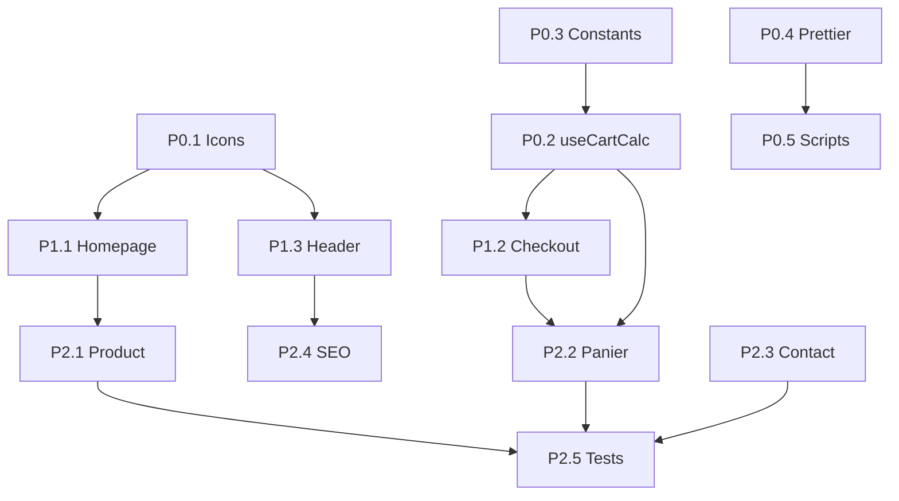

# PLAN DE REFACTORING - LOLETT

**Date**: 2026-01-30
**Base**: Audit STACK_STRUCTURE_AUDIT.md
**Objectif**: Atteindre les standards de qualite (pages < 180 lignes, composants < 150 lignes)

---a

## PHASES DE REFACTORING

### PHASE 0 (P0) - Quick Wins Immediats
**Objectif**: Reduire la dette technique sans risque
**Duree estimee**: 1-2 jours

| # | Tache | Complexite | Fichiers concernes | Dependances |
|---|-------|------------|-------------------|-------------|
| P0.1 | Creer `components/icons/` avec icones partagees | S | Header, Footer, page.tsx | Aucune |
| P0.2 | Creer `hooks/useCartCalculation.ts` | S | panier/page.tsx, checkout/page.tsx | Aucune |
| P0.3 | Extraire constantes cart vers `lib/constants.ts` | S | panier, checkout | P0.2 |
| P0.4 | Ajouter Prettier + config | S | Nouveau fichier | Aucune |
| P0.5 | Ajouter scripts npm manquants | S | package.json | P0.4 |

---

### PHASE 1 (P1) - Refactoring Structurel
**Objectif**: Decomposer les fichiers critiques
**Duree estimee**: 3-5 jours

#### P1.1 - Decomposition Homepage (478 -> ~100 lignes)

| # | Tache | Complexite | Output |
|---|-------|------------|--------|
| P1.1.1 | Extraire `HeroSection.tsx` | M | `components/sections/home/HeroSection.tsx` |
| P1.1.2 | Extraire `MarqueeSection.tsx` | S | `components/sections/home/MarqueeSection.tsx` |
| P1.1.3 | Extraire `NewArrivalsSection.tsx` | S | `components/sections/home/NewArrivalsSection.tsx` |
| P1.1.4 | Extraire `CollectionsSection.tsx` | M | `components/sections/home/CollectionsSection.tsx` |
| P1.1.5 | Extraire `LooksSection.tsx` | S | `components/sections/home/LooksSection.tsx` |
| P1.1.6 | Extraire `BrandStorySection.tsx` | S | `components/sections/home/BrandStorySection.tsx` |
| P1.1.7 | Extraire `TestimonialsSection.tsx` | S | `components/sections/home/TestimonialsSection.tsx` |
| P1.1.8 | Extraire `SocialFeedSection.tsx` | M | `components/sections/home/SocialFeedSection.tsx` |
| P1.1.9 | Extraire `NewsletterSection.tsx` | S | `components/sections/home/NewsletterSection.tsx` |
| P1.1.10 | Convertir `app/page.tsx` en Server Component | M | Composition uniquement |

**Dependances**: P0.1 (icones) doit etre fait avant

**Structure cible**:
```tsx
// app/page.tsx (~60-80 lignes)
import { HeroSection } from '@/components/sections/home/HeroSection';
import { MarqueeSection } from '@/components/sections/home/MarqueeSection';
// ... autres imports

export default function HomePage() {
  // Data fetching server-side
  const newProducts = getNewProducts(4);
  const looks = getLooks();
  const reviews = getReviews();

  return (
    <>
      <HeroSection />
      <MarqueeSection />
      <NewArrivalsSection products={newProducts} />
      <CollectionsSection />
      <LooksSection looks={looks} />
      <BrandStorySection />
      <TestimonialsSection reviews={reviews} />
      <SocialFeedSection />
      <NewsletterSection />
    </>
  );
}
```

#### P1.2 - Decomposition Checkout (313 -> ~80 lignes)

| # | Tache | Complexite | Output |
|---|-------|------------|--------|
| P1.2.1 | Creer `features/checkout/hooks/useCheckout.ts` | M | Logique form + submit |
| P1.2.2 | Extraire `CheckoutForm.tsx` | M | `features/checkout/components/CheckoutForm.tsx` |
| P1.2.3 | Extraire `CheckoutOrderSummary.tsx` | S | `features/checkout/components/OrderSummary.tsx` |
| P1.2.4 | Extraire `EmptyCart.tsx` | S | `components/cart/EmptyCart.tsx` (reutilisable) |
| P1.2.5 | Refactorer `app/checkout/page.tsx` | M | Composition + loading states |

**Dependances**: P0.2 (useCartCalculation)

#### P1.3 - Decomposition Header (311 -> ~80 lignes)

| # | Tache | Complexite | Output |
|---|-------|------------|--------|
| P1.3.1 | Extraire `DesktopNav.tsx` | M | `components/layout/header/DesktopNav.tsx` |
| P1.3.2 | Extraire `MobileMenu.tsx` | M | `components/layout/header/MobileMenu.tsx` |
| P1.3.3 | Extraire `SocialDropdown.tsx` | S | `components/layout/header/SocialDropdown.tsx` |
| P1.3.4 | Extraire `CartBadge.tsx` | S | `components/layout/header/CartBadge.tsx` |
| P1.3.5 | Extraire `FavoritesBadge.tsx` | S | `components/layout/header/FavoritesBadge.tsx` |
| P1.3.6 | Creer `hooks/useScrolled.ts` | S | Hook reutilisable |
| P1.3.7 | Refactorer `Header.tsx` | M | Composition uniquement |

**Dependances**: P0.1 (icones)

---

### PHASE 2 (P2) - Optimisations Avancees
**Objectif**: Performances, tests, DX
**Duree estimee**: 5-7 jours

#### P2.1 - Refactoring Composants Product

| # | Tache | Complexite | Output |
|---|-------|------------|--------|
| P2.1.1 | Extraire `ProductGallery.tsx` | M | `components/product/ProductGallery.tsx` |
| P2.1.2 | Extraire `SizeSelector.tsx` | S | `components/product/SizeSelector.tsx` |
| P2.1.3 | Extraire `ColorSelector.tsx` | S | `components/product/ColorSelector.tsx` |
| P2.1.4 | Extraire `QuantitySelector.tsx` | S | `components/product/QuantitySelector.tsx` |
| P2.1.5 | Extraire `ProductActions.tsx` | M | `components/product/ProductActions.tsx` |
| P2.1.6 | Refactorer `ProductDetails.tsx` | M | < 100 lignes |

#### P2.2 - Refactoring Page Panier (205 -> ~60 lignes)

| # | Tache | Complexite | Output |
|---|-------|------------|--------|
| P2.2.1 | Extraire `CartItem.tsx` | M | `features/cart/components/CartItem.tsx` |
| P2.2.2 | Reutiliser `OrderSummary` de P1.2.3 | S | Partage avec checkout |
| P2.2.3 | Refactorer `app/panier/page.tsx` | S | Composition |

**Dependances**: P1.2.3

#### P2.3 - Refactoring Page Contact (184 -> ~40 lignes)

| # | Tache | Complexite | Output |
|---|-------|------------|--------|
| P2.3.1 | Extraire `ContactForm.tsx` | M | `components/forms/ContactForm.tsx` |
| P2.3.2 | Extraire `ContactInfo.tsx` | S | `components/contact/ContactInfo.tsx` |
| P2.3.3 | Refactorer `app/contact/page.tsx` | S | Composition |

#### P2.4 - SEO & Performance

| # | Tache | Complexite | Output |
|---|-------|------------|--------|
| P2.4.1 | Ajouter `sitemap.ts` | S | `app/sitemap.ts` |
| P2.4.2 | Ajouter `robots.ts` | S | `app/robots.ts` |
| P2.4.3 | Ajouter metadata produits | M | `app/produit/[slug]/page.tsx` |
| P2.4.4 | Throttle scroll listeners | S | Homepage, Header |
| P2.4.5 | Optimiser images social feed | S | Alt text, sizes |

#### P2.5 - Tests & Documentation

| # | Tache | Complexite | Output |
|---|-------|------------|--------|
| P2.5.1 | Setup Vitest/Jest | M | Config + scripts |
| P2.5.2 | Tests unitaires hooks | M | `hooks/*.test.ts` |
| P2.5.3 | Tests composants critiques | L | ProductCard, CartItem |
| P2.5.4 | Creer CONTRIBUTING.md | S | Documentation |
| P2.5.5 | Documenter architecture | M | README technique |

---

## ORDRE D'EXECUTION RECOMMANDE



### Ordre Sequentiel

1. **Semaine 1**: P0.1 -> P0.2 -> P0.3 -> P0.4 -> P0.5
2. **Semaine 2**: P1.1 (Homepage - priorite haute)
3. **Semaine 3**: P1.2 (Checkout) + P1.3 (Header)
4. **Semaine 4**: P2.1 (Product) + P2.2 (Panier)
5. **Semaine 5**: P2.3 (Contact) + P2.4 (SEO)
6. **Semaine 6**: P2.5 (Tests)

---

## STANDARDS A APPLIQUER

### Limites de Taille (Strictes)

| Type | Limite | Hard Limit |
|------|--------|------------|
| Page (`app/**/page.tsx`) | 80-120 lignes | 180 lignes |
| Component | 80-120 lignes | 150 lignes |
| Hook | 40-80 lignes | 120 lignes |
| Utility function | 20-40 lignes | 80 lignes |
| Section (homepage) | 60-100 lignes | 120 lignes |

### Structure Feature-First

```
features/
└── [feature-name]/
    ├── components/      # Composants specifiques feature
    ├── hooks/           # Hooks specifiques feature
    ├── utils/           # Utilitaires specifiques
    ├── types.ts         # Types specifiques (optionnel)
    ├── store.ts         # Zustand store (si applicable)
    └── index.ts         # Barrel export
```

### Convention Server/Client

```typescript
// DEFAULT: Server Component (pas de directive)
export default function ProductPage() { ... }

// EXPLICITE: Client Component (uniquement si necessaire)
'use client';
export function InteractiveComponent() { ... }
```

**Regles**:
- `'use client'` uniquement si: useState, useEffect, event handlers, browser APIs
- Preferer passer handlers en props depuis parent client
- Isoler le client au plus petit scope possible

### Naming Conventions

| Element | Convention | Exemple |
|---------|------------|---------|
| Composant | PascalCase | `ProductCard.tsx` |
| Hook | camelCase (use prefix) | `useCartCalculation.ts` |
| Utility | camelCase | `formatPrice.ts` |
| Constant | SCREAMING_SNAKE | `FREE_SHIPPING_THRESHOLD` |
| Type/Interface | PascalCase | `CartItem` |
| Section | PascalCase + Section suffix | `HeroSection.tsx` |

### Import Order

```typescript
// 1. React/Next
import { useState, useEffect } from 'react';
import Image from 'next/image';
import Link from 'next/link';

// 2. External libraries
import { ShoppingBag, Heart } from 'lucide-react';

// 3. Internal: components
import { Button } from '@/components/ui/button';
import { ProductCard } from '@/components/product/ProductCard';

// 4. Internal: features/hooks
import { useCartStore } from '@/features/cart/store';

// 5. Internal: utils/lib
import { cn } from '@/lib/utils';

// 6. Internal: types
import type { Product } from '@/types';

// 7. Internal: data (mock)
import { products } from '@/data/products';
```

---

## CHECKLIST DE VALIDATION

### Avant Merge PR

- [ ] Fichier < limite de lignes applicable
- [ ] Pas de `'use client'` si non necessaire
- [ ] Pas de logique metier dans les pages
- [ ] Imports ordonnes selon convention
- [ ] Types TypeScript explicites (pas de `any`)
- [ ] aria-labels sur elements interactifs
- [ ] Tests passes (quand implementes)
- [ ] Lint passe sans warning

### Validation Post-Refactor

- [ ] Build Next.js reussi
- [ ] Aucune erreur TypeScript
- [ ] Performances Lighthouse > 90
- [ ] Fonctionnalites inchangees (regression test)

---

## METRIQUES DE SUCCES

| Metrique | Avant | Cible P0 | Cible P1 | Cible P2 |
|----------|-------|----------|----------|----------|
| Fichiers > 200 lignes | 6 | 5 | 0 | 0 |
| Fichiers > 150 lignes | 10 | 8 | 3 | 0 |
| Duplication code | ~50 lignes | 0 | 0 | 0 |
| Pages full-client inutiles | 1 | 1 | 0 | 0 |
| Couverture tests | 0% | 0% | 0% | > 50% |

---

## RISQUES ET MITIGATIONS

| Risque | Probabilite | Impact | Mitigation |
|--------|-------------|--------|------------|
| Regression fonctionnelle | Moyenne | Haute | Tests manuels + snapshot |
| Breaking changes imports | Faible | Moyenne | Barrel exports (index.ts) |
| Performance degradee | Faible | Haute | Lighthouse avant/apres |
| Conflits merge | Moyenne | Faible | PRs atomiques par tache |

---

## RESSOURCES NECESSAIRES

### Temps Developeur

| Phase | Temps estime | Priorite |
|-------|--------------|----------|
| P0 | 1-2 jours | Immediate |
| P1 | 3-5 jours | Haute |
| P2 | 5-7 jours | Moyenne |
| **Total** | **9-14 jours** | - |

### Outils Recommandes

- **ESLint plugin**: `eslint-plugin-import` pour ordre imports
- **Prettier**: Formatage automatique
- **Vitest**: Tests unitaires
- **Testing Library**: Tests composants
- **Lighthouse CI**: Monitoring performance

---

*Plan de refactoring genere par Claude Code - Staff Engineer Frontend*
